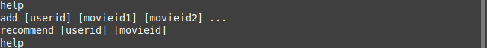
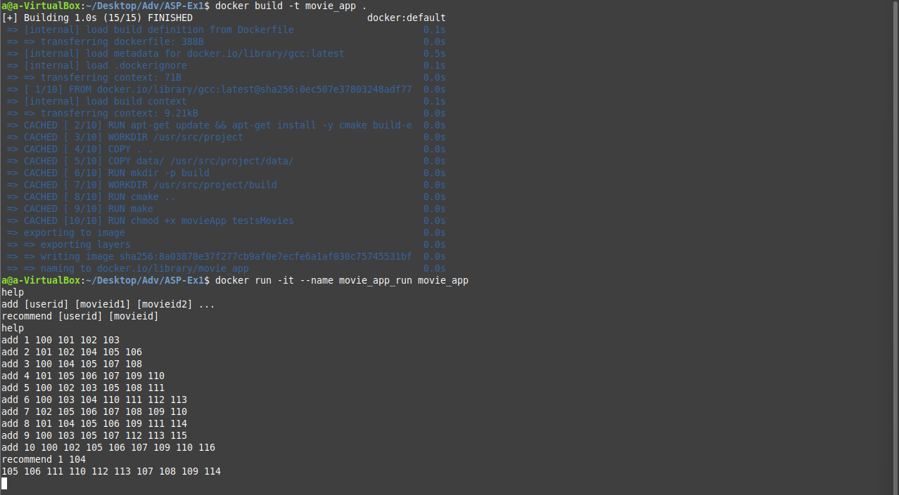
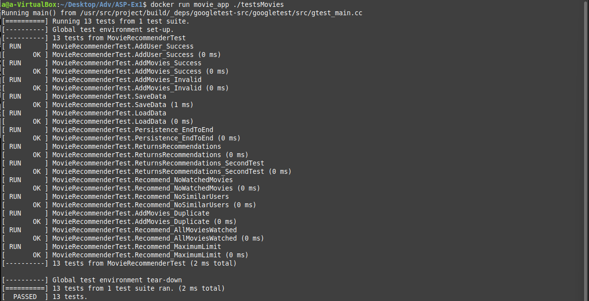

# **Movie Recommendation System**

This is the first phase of a four-part project for the Advanced System Programming (Full Stack) course.

This program provides a command-line interface (CLI) that will be used as a movie recommendation system. 

The program supports the following commands:

### **1. Add Watched Movies**
```bash
add [userid] [movieid1] [movieid2] ...
```


**Description:** The command associates a list of movies (movie IDs) with a user (user ID), indicating that the user has watched these movies.

**Example:**
running the add command


--------------------------------------------------------

### **2. Get Movie Recommendations**
```bash
recommend [userid] [movieid]
```
**Description:** The command allows you to input a user ID and a single movie ID. The system will provide up to 10 additional movie recommendations based on the viewing preferences of other users with similar tastes.

**Example:**

running the recommend command


This will print something like:


depending on the movie ID and the appropriate recommendations

--------------------------------------------------------

### **3. Display Help**
```bash
help
```
**Description:** The command will print a list of all available commands on the screen..

**Example:**

run the help command


This will print this:




## **Instructions to Run the Program Using Docker**

First we need to build the docker image and start a container, this will run the program in a docker container

### **1. Build docker image**

```bash
docker build -t movie_app .
```
This command creates a Docker image named `movie_app` using the Dockerfile in the current directory.


### **2. Start the container**
```bash
docker run -it --name movie_app_run movie_app
```
This command starts a container named `movie_app_run` from the `movie_app` image, allowing interactive usage.


--------------------------------------------------------
If the container was stopped or if it is not active in the terminal you can
### **Resume the container**
```bash
docker start -i movie_app_run
```

--------------------------------------------------------

### **Stop the container**
```bash
docker stop movie_app_run
```


--------------------------------------------------------
### **Example of a complete run**



--------------------------------------------------------

### **5. Run Tests**
To run tests after building the docker image use this command:

```bash
docker run movie_app ./testsMovies
```
