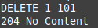
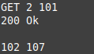
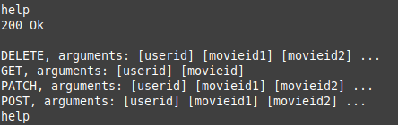
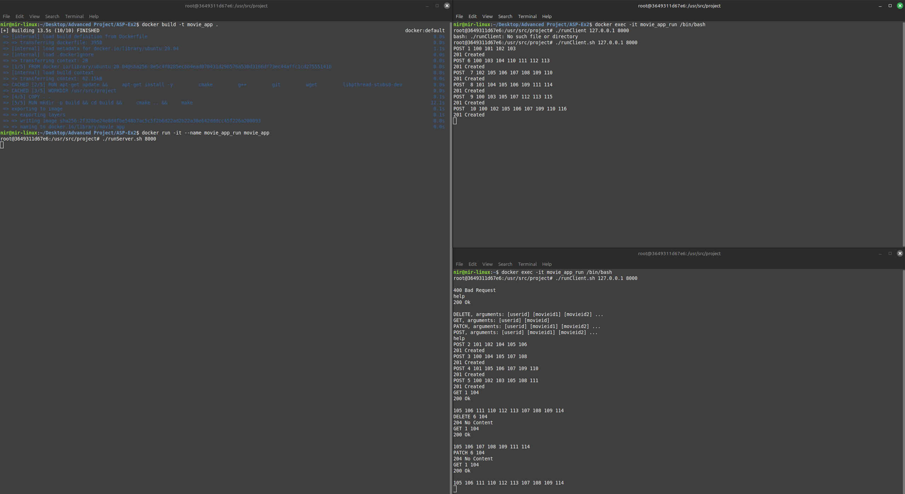
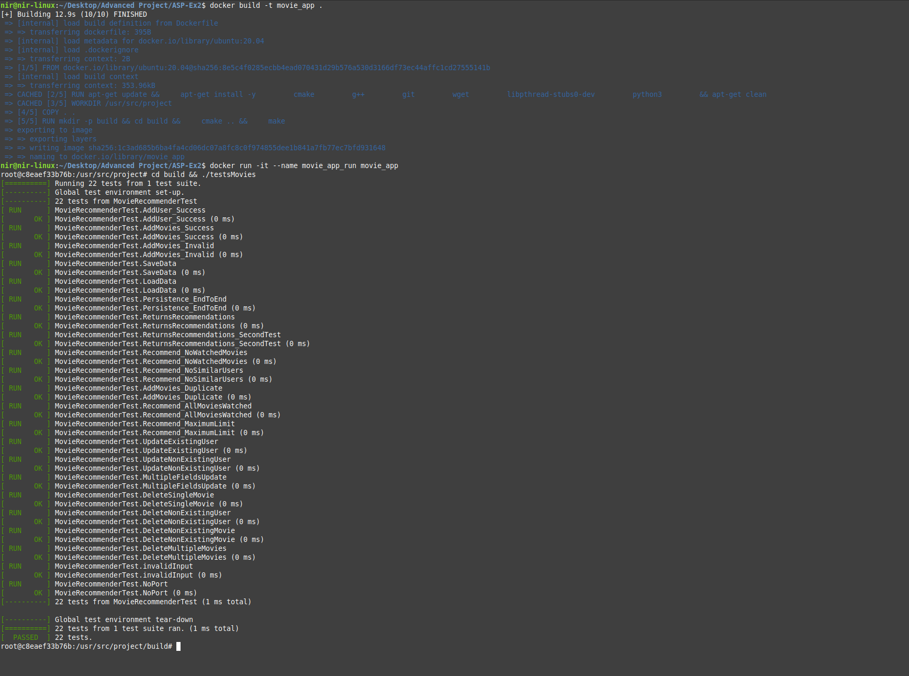

# **Movie Recommendation System**

This program provides a command-line interface (CLI) that will be used as a movie recommendation system. 

The program supports the following commands:

### **Post command**
```bash
POST [userid] [movieid1] [movieid2] ...
```


**Description:** If the user does not exist, the command associates a list of movies (movie IDs) with the new user (user ID), indicating that the user has watched these movies.

**Example:**
running a valid POST command


--------------------------------------------------------

### **PATCH command**
```bash
PATCH [userid] [movieid1] [movieid2] ...
```

**Description:** If the user exists, the command associates a list of movies (movie IDs) with a user (user ID), indicating that the user has watched these movies.

**Example:**
running a valid PATCH command


--------------------------------------------------------

### **DELETE command**
```bash
DELETE [userid] [movieid1] [movieid2] ...
```
**Description:** The command allows you to delete watch history from a user

**Example:**

running a valid DELETE command



--------------------------------------------------------

### **GET command**
```bash
GET [userid] [movieid]
```
**Description:** The GET command allows you to input a user ID and a single movie ID. The system will provide up to 10 additional movie recommendations based on the viewing preferences of other users with similar tastes.

**Example:**

running a valid GET command will print something like:




depending on the movie ID and the appropriate recommendations

--------------------------------------------------------


### **3. Display Help**
```bash
help
```
**Description:** The command will print a list of all available commands on the screen.

**Example:**

running the help command will print this:




----------------------------------------------------------------------------------------------------------------


## **Instructions to Run the Program Using Docker**

First we need to build the docker image and start a container, this will run the program in a docker container

### **1. Build docker image**

```bash
docker build -t movie_app .
```
This command creates a Docker image named `movie_app` using the Dockerfile in the current directory.


### **2. Run a container from the docker image**
```bash
docker run -it --name movie_app_run movie_app
```
This command starts a container named `movie_app_run` from the `movie_app` image.

### **3. If you are working on windows, use this command to convert ./runServer.sh from linux to windows**
```bash
sed -i 's/\r//' runServer.sh 
```
Convert ./runServer.sh from linux to windows

### **4. Run the server inside the container with port number**
```bash
./runServer.sh <portNumber>
```
Replace portNumber with your selected port number.

### **5. Run the client inside the container with port number and ip address**
To run a client, after the docker container is already running, open a new terminal and run
```bash
docker exec -it movie_app_run /bin/bash
```

Then run the client
```bash
./runClient.sh <ipAddress> <portNumber>
```
Replace ipAddress and portNumber with your selected ip address and the port number you selected for the server

**If you are working on windows, use this command before running the client, to convert ./runClient.sh from linux to windows**
```bash
sed -i 's/\r//' runClient.sh 
```
Convert ./runClient.sh from linux to windows


You can now run the commands on the client side

--------------------------------------------------------

### **Stop the container**
From a terminal that is not running inside the docker container
```bash
docker stop movie_app_run
```

From a terminal that is running inside the docker container press CTRL+D

--------------------------------------------------------

If the container was stopped 
### **Resume the container**
```bash
docker start -i movie_app_run
```
--------------------------------------------------------

### **Example of a complete run**



--------------------------------------------------------

### **Run Tests**
To run tests after building the docker image use this command inside the container terminal:

```bash
cd build && ./testsMovies
```



--------------------------------------------------------
### **Answers to the questions in the exercise**

In contrast to the first part of the exercise, in which all the commands were implemented within the execution file, in this part we understood that the right logic should be different, so we changed the code so that every command - new or old - will be implemented in its own .h/.cpp file. Therefore:
The fact that the names of the commands have changed, required us to touch the code that should be "closed to changes and open to expansion". In this exercise, we fixed it by registering the commands, and with the method mentioned above.
The fact that new commands were added, required us to touch the code that should be "closed to changes and open to expansion". In this exercise, with the addition of our new logic, it would be easy to implement new commands.
The fact that the output of the commands changed, required us to touch the code that should be "closed to changes and open to expansion. In this exercise, the output is not in the file of the program run, but instead in their own files, as mentioned above.
The fact that the input/output comes from the sockets and not from the console, required us to touch the code that should be "closed to changes and open to expansion". In this exercise, we fixed it by implementing the threads and mutex.

